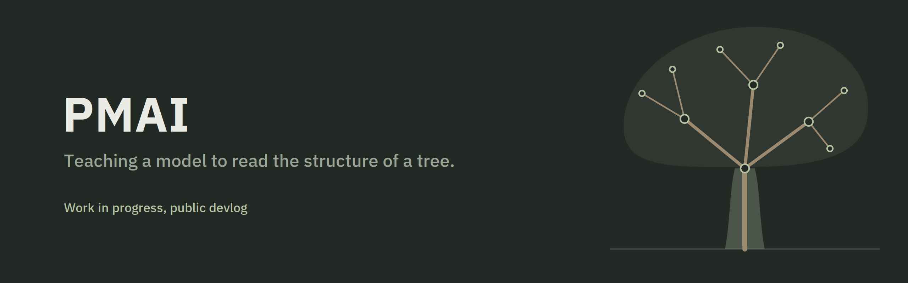
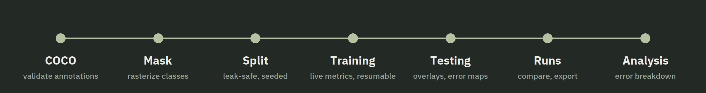
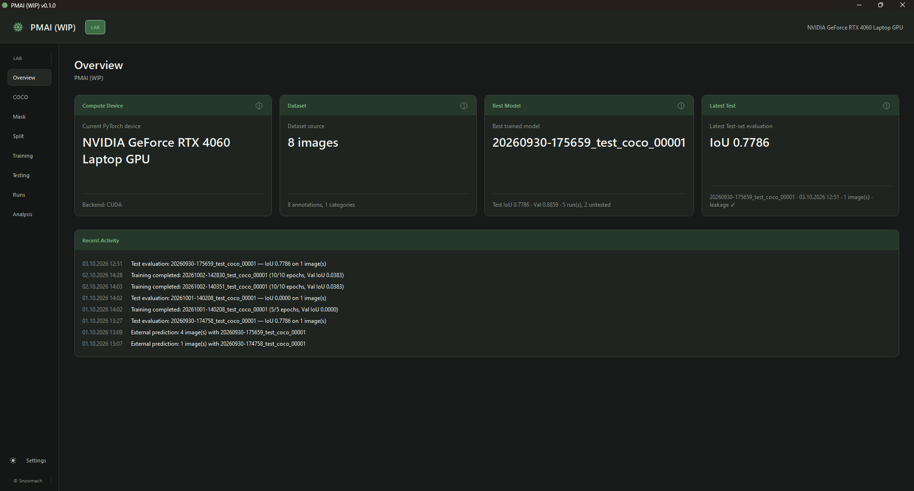

PMAI is a work-in-progress computer vision project about recognizing trees in images: segmenting trunk, branches and canopy, and building the tools to train, test and understand those models.

This repository is the public devlog. The code is private.

## Where it stands

The Lab, the desktop tool that builds and evaluates the models, works end to end. The first model segments the trunk only and was trained on a small sample set. A larger set of real-world tree photos is being collected now.

  

## Devlog

| | Entry | Month |
|---|---|---|
| 001 | [Building the Lab](devlog/001-building-the-lab.md) | October 2026 |

## Roadmap

- [x] Lab: annotation import, mask generation, seeded splits, training, testing, run history, error analysis
- [ ] Real-world tree dataset
- [ ] Multi-class segmentation: trunk, main branches, side branches, canopy
- [ ] Deeper error analysis and model comparison across datasets

## Built with

Python, PySide6, PyTorch on CUDA, OpenCV.
