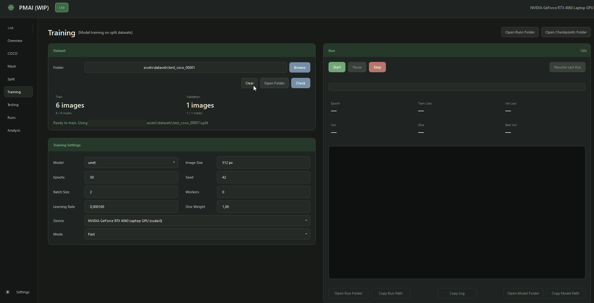
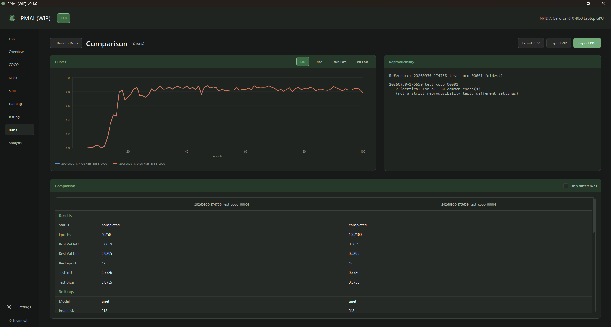
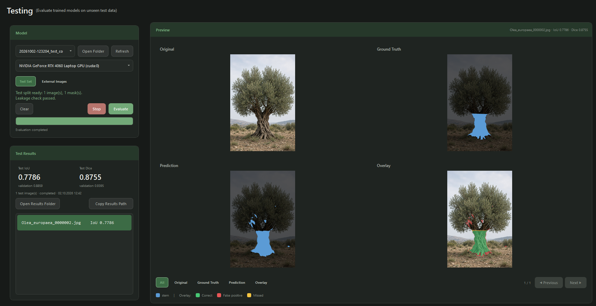
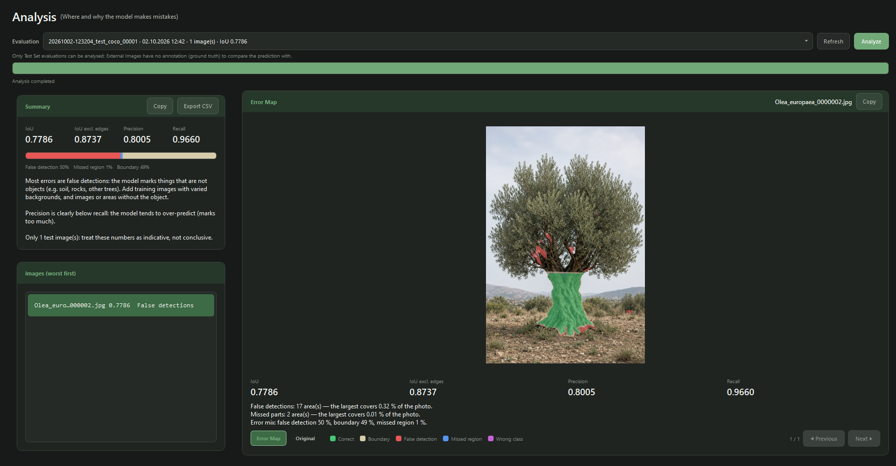

# 001: Building the Lab

*October 2026*

  

Before teaching a model to read a tree, I needed somewhere to build, test and compare models without guesswork. That is the Lab: a desktop app that takes labeled photos in and gives trained, measured models out.

## The first model painted everything

In the first test image, about 7.6% of the pixels were trunk. The first model labeled about 95% of the image as trunk. IoU: 0.08.

A model that says yes to everything looks busy and learns nothing. After fixing the training setup, the same data gave a model that actually traced the trunk. Since then, every result goes through the same split, the same metrics and the same error analysis.

## Results you can repeat

- **Deterministic mode:** same data, same seed, same machine, same result.
- **Data fingerprints:** each run stores a SHA-256 hash of every image it used.
- **Test isolation:** test images are checked against training images by fingerprint before evaluation.
- **Pause, resume, stop:** long runs survive interruptions.

  

A 50-epoch and a 100-epoch run with the same seed. Identical for all 50 shared epochs: the blue line is hidden under the orange one.

## Where the model goes wrong

  

Trunk only, 8 sample images (not field photos) split 6 / 1 / 1, 50 epochs, deterministic:

| Validation IoU | Test IoU | Precision | Recall |
|---|---|---|---|
| 0.886 | 0.779 | 0.80 | 0.97 |

With one validation and one test image, these numbers check that the pipeline works. They say nothing yet about real-world photos.

The model finds almost every trunk pixel (recall 0.97) but also claims things that are not trunk. The error analysis splits the mistakes roughly in half:

- **False alarms** on thick branches, the root base and soil.
- **Edge errors** along the trunk outline.

  

Both point to the same fix: real, varied data and clearer labeling rules.

## Next

Real-world tree photos: 25 trees, several angles each, labeled into trunk, main branches, side branches and canopy. Photos of the same tree stay in the same split, so the test score reflects trees the model has never seen.